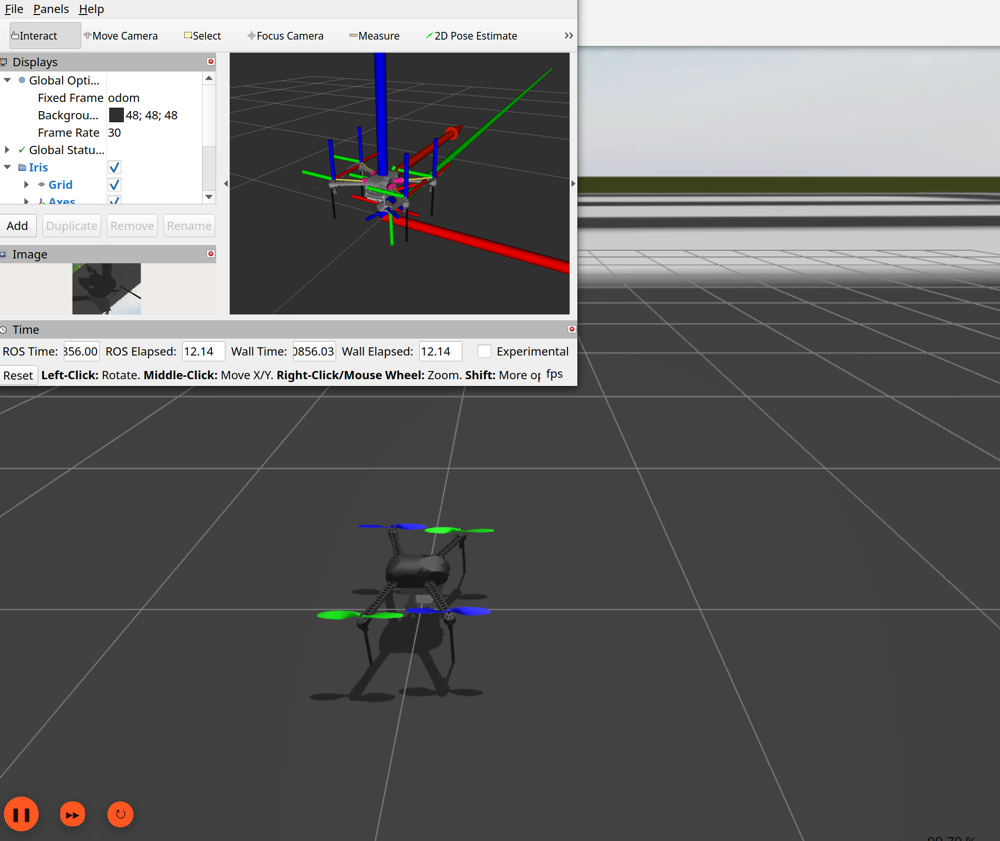

This documentation records a clean setup performed on Ubuntu 24.04.4 LTS Noble. The recommended stack here is ROS 2 Jazzy, Gazebo Harmonic, and ArduPilot SITL.

<div class="agent-download-card">
  <div class="agent-download-main">
    <div class="agent-download-logos" aria-label="Agent tools">
      <a class="agent-logo agent-logo-codex" href="https://openai.com/codex/" title="Open Codex official website" target="_blank" rel="noopener">
        <svg viewBox="0 0 64 64" aria-hidden="true" focusable="false">
          <defs>
            <linearGradient id="codex-agent-gradient" x1="32" x2="32" y1="8" y2="56" gradientUnits="userSpaceOnUse">
              <stop offset="0" stop-color="#b5a0ff" />
              <stop offset="0.52" stop-color="#6b8eff" />
              <stop offset="1" stop-color="#2f3fff" />
            </linearGradient>
          </defs>
          <path fill="url(#codex-agent-gradient)" d="M25.8 54.8c-5.5 0-10.3-3.4-12.2-8.2C7.8 44.8 4 39.4 4 33.1c0-7.1 4.9-13.1 11.5-14.7C18.2 12.4 24.2 8.2 31 8.2c5.1 0 9.8 2.1 13.1 5.6 1.5-.4 3-.7 4.7-.7 8 0 14.5 6.5 14.5 14.5 0 2.2-.5 4.2-1.3 6 2.4 2.2 3.8 5.4 3.8 8.9 0 6.8-5.5 12.3-12.3 12.3H25.8Z" />
          <path d="M24.4 26.2 31.3 33l-6.9 6.8" fill="none" stroke="#fff" stroke-linecap="round" stroke-linejoin="round" stroke-width="5.4" />
          <path d="M40.2 39.2h10.6" fill="none" stroke="#fff" stroke-linecap="round" stroke-width="5.4" />
        </svg>
        Codex
      </a>
      <a class="agent-logo agent-logo-claude" href="https://claude.com/product/claude-code" title="Open Claude Code official website" target="_blank" rel="noopener">
        <svg viewBox="-9 1 86 92" aria-hidden="true" focusable="false">
          <path fill="#d87553" d="M31.4 24.4 36.2 5.1l3-2.1 3.7 1.9 2.1 2.8-4.2 22.4.9.8 12.8-15.6 5.3-.1 3 4.2-1.1 3.9-16 18.4.6 1.1 20.4-4.4 4.4 1.2 1.4 3.2-1.3 3.2-22.6 5.4v1l21.6 2 5.6 3.8.4 3.5-3.7 2.3-20.6-4.5-.8.8 15 14.4.6 4.2-2.5 2.7-4.2-1.6-16-14.8-1 .6 10.4 16.2-.1 4.9-2.9 2.2-4.3-.4-13.1-20.1-1.2.3-3.8 21.4-3.1 2.1-3.5-1.8-1.5-3 4.6-22.4-1-.6-15 19.3-3.5 1.7-2.8-1.5-.4-3.1 15.7-20.8-.6-1.1-18.2 12.9-5 1.6-2.2-2.3.4-3.9L20.9 53l-.2-1.2-24.1-1-4-2.4.2-3.3 2.3-2.1 24.9 1.6.5-1.1L.8 30.6-.4 26.8l2.7-2.4 4.2.4L28.1 40l1.1-.5L14.6 15.8l-.9-4.3 2.5-3.2 4.4.3 11.7 26.1 1.3-.2Z" />
        </svg>
        Claude Code
      </a>
    </div>
    <p><strong>Using an agent to install this stack?</strong> Download the agent-oriented Markdown guide and give it directly to Codex, Claude Code, Cursor Agent, or a similar coding agent.</p>
  </div>
  <a class="agent-download-button" href="/downloads/Ubuntu24-ArduPilot-ROS2-Jazzy-Gazebo-Harmonic-SITL-Agent-Installation-Guide.md" download>
    Download MD
  </a>
</div>

## 0. Initial System State

```shell
uname -a
lsb_release -a
ls -la /opt/ros
command -v ros2
command -v gz
command -v colcon
command -v vcs
```

The initial checks on this machine were:

```text
Ubuntu 24.04.4 LTS, codename noble
/opt/ros does not exist
ros2: command not found
gz: command not found
colcon: command not found
vcs: command not found
```

Therefore this guide assumes a clean Ubuntu 24.04 environment and does not reuse an older ROS 2 Humble setup.

## 1. Version Choices

| Component | 2026 choice | Notes |
|---|---|---|
| Ubuntu | 24.04 LTS Noble | Local system version |
| ROS 2 | Jazzy Jalisco | ROS 2 Jazzy Debian packages target Ubuntu 24.04 Noble |
| Gazebo | Harmonic LTS | Gazebo Harmonic supports Ubuntu 22.04/24.04 and is maintained until 2029-05 |
| ArduPilot ROS 2 workspace | `~/ardu_ws` | Uses ArduPilot `Tools/ros2/ros2.repos` and `ardupilot_gz` |
| DDS | ArduPilot DDS + micro-ROS Agent | Required by ArduPilot ROS 2 SITL |

Official references:

- [ArduPilot ROS 2](https://ardupilot.org/dev/docs/ros2.html)
- [ArduPilot ROS 2 with SITL](https://ardupilot.org/dev/docs/ros2-sitl.html)
- [ArduPilot ROS 2 with Gazebo](https://ardupilot.org/dev/docs/ros2-gazebo.html)
- [ROS 2 Jazzy Ubuntu deb packages](https://docs.ros.org/en/jazzy/Installation/Ubuntu-Install-Debs.html)
- [Gazebo Harmonic on Ubuntu](https://gazebosim.org/docs/harmonic/install_ubuntu/)

## 2. Install ROS 2 Jazzy

### 2.1 Locale

```shell
locale
sudo apt update
sudo apt install locales -y
sudo locale-gen en_US en_US.UTF-8
sudo update-locale LC_ALL=en_US.UTF-8 LANG=en_US.UTF-8
export LANG=en_US.UTF-8
locale
```

### 2.2 Enable Ubuntu Universe

```shell
sudo apt install software-properties-common -y
sudo add-apt-repository universe
```

### 2.3 Add the ROS 2 Apt Source

In 2026, ROS recommends using the `ros2-apt-source` package to manage the apt source and key.

Install only the minimal required tools first. Do not combine this with `python3-vcstool`, `python3-colcon-common-extensions`, or `python3-rosdep`; if one package is unavailable before the ROS source is added, the whole `apt install` command fails.

```shell
sudo apt update
sudo apt install curl gnupg lsb-release software-properties-common locales -y
```

```shell
sudo apt update
sudo apt install curl -y
export ROS_APT_SOURCE_VERSION=$(curl -s https://api.github.com/repos/ros-infrastructure/ros-apt-source/releases/latest | grep -F "tag_name" | awk -F'"' '{print $4}')
curl -L -o /tmp/ros2-apt-source.deb "https://github.com/ros-infrastructure/ros-apt-source/releases/download/${ROS_APT_SOURCE_VERSION}/ros2-apt-source_${ROS_APT_SOURCE_VERSION}.$(. /etc/os-release && echo ${UBUNTU_CODENAME:-${VERSION_CODENAME}})_all.deb"
sudo dpkg -i /tmp/ros2-apt-source.deb
```

### 2.4 Install ROS 2 Jazzy Desktop and Development Tools

```shell
sudo apt update
sudo apt full-upgrade -y
sudo apt install ros-jazzy-desktop ros-dev-tools -y
```

If `ros-dev-tools` has dependency conflicts, verify that Noble updates and backports are enabled:

```shell
grep Suites /etc/apt/sources.list.d/ubuntu.sources
```

The normal suites should include:

```text
Suites: noble noble-updates noble-backports
```

### 2.5 ROS 2 Environment Variables

Test manually first:

```shell
source /opt/ros/jazzy/setup.bash
printenv | grep -i ROS
ros2 pkg list | head
```

Then add this to `~/.bashrc`:

```shell
cat <<'EOF' >> ~/.bashrc

# ROS 2 Jazzy, Ubuntu 24.04
source /opt/ros/jazzy/setup.bash
export ROS_DOMAIN_ID=0
export ROS_LOCALHOST_ONLY=0
EOF
source ~/.bashrc
```

### 2.6 Test ROS 2

Terminal 1:

```shell
source /opt/ros/jazzy/setup.bash
ros2 run demo_nodes_cpp talker
```

Terminal 2:

```shell
source /opt/ros/jazzy/setup.bash
ros2 run demo_nodes_py listener
```

If the listener receives messages from the talker, the ROS 2 base installation works.

## 3. Install Gazebo Harmonic

```shell
sudo apt-get update
sudo apt-get install curl lsb-release gnupg -y
sudo curl https://packages.osrfoundation.org/gazebo.gpg --output /usr/share/keyrings/pkgs-osrf-archive-keyring.gpg
echo "deb [arch=$(dpkg --print-architecture) signed-by=/usr/share/keyrings/pkgs-osrf-archive-keyring.gpg] https://packages.osrfoundation.org/gazebo/ubuntu-stable $(lsb_release -cs) main" | sudo tee /etc/apt/sources.list.d/gazebo-stable.list > /dev/null
sudo apt-get update
sudo apt-get install gz-harmonic -y
```

Add this to `~/.bashrc`:

```shell
cat <<'EOF' >> ~/.bashrc

# Gazebo Harmonic for ArduPilot ROS 2 simulation
export GZ_VERSION=harmonic
EOF
source ~/.bashrc
```

Verify:

```shell
gz sim --versions
```

For this 2026 stack, use Gazebo Harmonic. Avoid installing `libgazebo-dev` or `gazebo11`, which belong to the Gazebo Classic path and can conflict with `gz-harmonic`.

## 4. Install ArduPilot/ROS 2 Development Dependencies

```shell
sudo apt update
sudo apt install git gitk git-gui python3-vcstool python3-colcon-common-extensions python3-rosdep python3-pip default-jre wget socat -y
```

Initialize `rosdep`:

```shell
sudo rosdep init
rosdep update
```

If `sudo rosdep init` reports that it is already initialized, ignore it and continue with `rosdep update`.

## 5. Create the ArduPilot ROS 2 Workspace

```shell
mkdir -p ~/ardu_ws/src
cd ~/ardu_ws
vcs import --recursive --input https://raw.githubusercontent.com/ArduPilot/ardupilot/master/Tools/ros2/ros2.repos src
```

Import the Gazebo repositories:

```shell
cd ~/ardu_ws
vcs import --input https://raw.githubusercontent.com/ArduPilot/ardupilot_gz/main/ros2_gz.repos --recursive src
```

Check the source tree:

```shell
find ~/ardu_ws/src -maxdepth 2 -type d | sort
```

## 6. Install ArduPilot Dependencies

```shell
cd ~/ardu_ws/src/ardupilot
./Tools/environment_install/install-prereqs-ubuntu.sh -y
. ~/.profile
```

If the script changes environment variables, open a new terminal or run:

```shell
source ~/.bashrc
source ~/.profile
```

## 7. Install ROS/Gazebo Package Dependencies

```shell
cd ~/ardu_ws
source /opt/ros/jazzy/setup.bash
export GZ_VERSION=harmonic
sudo apt update
rosdep update
rosdep install --from-paths src --ignore-src -r -y
```

## 8. Build the ArduPilot ROS 2 + Gazebo Workspace

Build SITL first:

```shell
cd ~/ardu_ws
source /opt/ros/jazzy/setup.bash
colcon build --packages-up-to ardupilot_sitl
```

Then build the Gazebo bringup packages:

```shell
cd ~/ardu_ws
source /opt/ros/jazzy/setup.bash
source install/setup.bash
export GZ_VERSION=harmonic
colcon build --packages-up-to ardupilot_gz_bringup
```

Add this to `~/.bashrc`:

```shell
cat <<'EOF' >> ~/.bashrc

# ROS 2 Jazzy + ArduPilot Gazebo SITL
source /opt/ros/jazzy/setup.bash
export ROS_DOMAIN_ID=0
export ROS_LOCALHOST_ONLY=0
export GZ_VERSION=harmonic
source ~/ardu_ws/install/setup.bash
export GZ_SIM_RESOURCE_PATH=$GZ_SIM_RESOURCE_PATH:$HOME/ardu_ws/install/ardupilot_gazebo/share
export SDF_PATH=$GZ_SIM_RESOURCE_PATH
export JAVA_HOME=/usr/lib/jvm/java-17-openjdk-amd64
export PATH=$JAVA_HOME/bin:$HOME/venv-ardupilot/bin:$PATH:$HOME/Micro-XRCE-DDS-Gen/scripts
EOF
source ~/.bashrc
```

After this, a new terminal should be able to run:

```shell
ros2 launch ardupilot_gz_bringup iris_runway.launch.py
```

## 9. Test ROS 2 SITL

```shell
cd ~/ardu_ws
source /opt/ros/jazzy/setup.bash
source install/setup.bash
ros2 launch ardupilot_sitl sitl_dds_udp.launch.py \
  transport:=udp4 \
  synthetic_clock:=True \
  wipe:=False \
  model:=quad \
  speedup:=1 \
  slave:=0 \
  instance:=0 \
  defaults:=$(ros2 pkg prefix ardupilot_sitl)/share/ardupilot_sitl/config/default_params/copter.parm,$(ros2 pkg prefix ardupilot_sitl)/share/ardupilot_sitl/config/default_params/dds_udp.parm \
  sim_address:=127.0.0.1 \
  master:=tcp:127.0.0.1:5760 \
  sitl:=127.0.0.1:5501
```

In a new terminal, check the ROS 2 graph:

```shell
source ~/ardu_ws/install/setup.bash
ros2 node list
ros2 node info /ap
ros2 topic list
ros2 topic echo /ap/geopose/filtered
```

If there are no ROS topics, check the ArduPilot parameters:

```shell
param show DDS_ENABLE
param set DDS_ENABLE 1
param show DDS_DOMAIN_ID
param set DDS_DOMAIN_ID 0
```

## 10. Test Gazebo Co-Simulation

```shell
cd ~/ardu_ws
source /opt/ros/jazzy/setup.bash
source install/setup.bash
export GZ_VERSION=harmonic
ros2 launch ardupilot_gz_bringup iris_runway.launch.py
```

This launch file starts ArduPilot SITL, Gazebo, and RViz.



## 11. Control with MAVProxy

After the simulation starts, connect from a new terminal:

```shell
mavproxy.py --master=127.0.0.1:14550
```

Inside MAVProxy:

```text
mode guided
arm throttle
takeoff 10
```

## 12. Common Verification and Debugging

Check versions:

```shell
lsb_release -a
ros2 pkg list | head
gz sim --versions
colcon version-check
vcs --version
cd ~/ardu_ws/src/ardupilot && git describe --tags --always --dirty
```

Check environment variables:

```shell
printenv | grep -E 'ROS|GZ'
```

Clean and rebuild:

```shell
cd ~/ardu_ws
rm -rf build install log
source /opt/ros/jazzy/setup.bash
export GZ_VERSION=harmonic
colcon build --packages-up-to ardupilot_gz_bringup
```

If you see `ROS_DISTRO was set to 'humble' before`, the shell probably sourced an old Humble environment from `~/.bashrc` or the current terminal. On Ubuntu 24.04, this guide should only source:

```shell
source /opt/ros/jazzy/setup.bash
source ~/ardu_ws/install/setup.bash
```

## 13. Common Issues

### 13.1 One Missing Apt Package Prevents `curl` from Installing

Symptom:

```text
E: Unable to locate package python3-vcstool
E: Unable to locate package python3-colcon-common-extensions
E: Unable to locate package python3-rosdep
Command 'curl' not found
dpkg: error: cannot access archive '/tmp/ros2-apt-source.deb': No such file or directory
E: Unable to locate package ros-jazzy-desktop
```

Cause:

If `curl`, `python3-vcstool`, `python3-colcon-common-extensions`, and `python3-rosdep` are placed in the same `apt install` command before the ROS source is added, one unavailable package causes the entire command to fail. As a result, `curl` is not installed, the ROS 2 apt source cannot be downloaded, and `ros-jazzy-desktop` is unavailable.

Fix:

Install only the minimal tools first:

```shell
sudo apt update
sudo apt install curl gnupg lsb-release software-properties-common locales -y
```

Then add the ROS 2 source and install ROS:

```shell
export ROS_APT_SOURCE_VERSION=$(curl -s https://api.github.com/repos/ros-infrastructure/ros-apt-source/releases/latest | grep -F "tag_name" | awk -F'"' '{print $4}')
echo $ROS_APT_SOURCE_VERSION

curl -L -o /tmp/ros2-apt-source.deb "https://github.com/ros-infrastructure/ros-apt-source/releases/download/${ROS_APT_SOURCE_VERSION}/ros2-apt-source_${ROS_APT_SOURCE_VERSION}.$(. /etc/os-release && echo ${UBUNTU_CODENAME:-${VERSION_CODENAME}})_all.deb"

sudo dpkg -i /tmp/ros2-apt-source.deb
sudo apt update
sudo apt install ros-jazzy-desktop ros-dev-tools -y
```

### 13.2 `ros-jazzy-desktop` Cannot Be Found

Symptom:

```text
E: Unable to locate package ros-jazzy-desktop
```

Check:

```shell
find /etc/apt/sources.list.d -maxdepth 1 -type f -printf '%f\n' | sort
apt-cache policy ros-jazzy-desktop ros2-apt-source
```

If the ROS 2 source is missing, rerun the `ros2-apt-source` steps in section 2.3.

### 13.3 `ros-dev-tools` Dependency Conflicts

Symptom:

Installing `ros-dev-tools` reports dependency conflicts, especially when Ubuntu 24.04 apt sources include only `noble` and not `noble-updates` or `noble-backports`.

Check:

```shell
grep Suites /etc/apt/sources.list.d/ubuntu.sources
```

Recommended suites:

```text
Suites: noble noble-updates noble-backports
```

After fixing the apt sources, update the system:

```shell
sudo apt clean
sudo apt update
sudo apt full-upgrade -y
```

### 13.4 Old Humble Environment Is Mixed In

Symptom:

```text
ROS_DISTRO was set to 'humble' before
```

Cause:

`~/.bashrc` or the current terminal sourced an old Humble environment. The Ubuntu 24.04 route in this guide uses Jazzy.

Fix:

Edit `~/.bashrc` and comment out old Humble lines:

```shell
gedit ~/.bashrc
```

Keep only the Jazzy setup:

```shell
source /opt/ros/jazzy/setup.bash
source ~/ardu_ws/install/setup.bash
export ROS_DOMAIN_ID=0
export ROS_LOCALHOST_ONLY=0
export GZ_VERSION=harmonic
```

### 13.5 Remote Tools Cannot Enter the Sudo Password

Symptom:

```text
sudo: a terminal is required to read the password
sudo: a password is required
```

Cause:

Some remote execution tools cannot display the interactive sudo password prompt. Even if `sudo -v` was run in a local terminal, the sudo cache can be tied to a different TTY and may not be shared across sessions.

Fix:

Run the `sudo apt ...` steps manually in a local terminal, then check:

```shell
command -v ros2
command -v gz
command -v colcon
command -v vcs
```

### 13.6 `ros2 --version` or `colcon --version` Fails

Symptom:

```text
ros2: error: unrecognized arguments: --version
colcon: error: argument verb_name: invalid choice: '--version'
```

Cause:

The ROS 2 Jazzy `ros2` CLI and the current `colcon` command do not use `--version` as their version check.

Use:

```shell
source /opt/ros/jazzy/setup.bash
printenv | grep -E 'ROS_VERSION|ROS_DISTRO|ROS_PYTHON_VERSION'
ros2 pkg list | head
colcon version-check
vcs --version
rosdep --version
```

### 13.7 Official Repos Still Pull Humble Branches on Ubuntu 24.04/Jazzy

Symptom:

`rosdep install` reports old Ignition/Gazebo dependencies that cannot be resolved, such as:

```text
No definition of [ignition-gazebo6] for OS version [noble]
No definition of [ignition-transport11] for OS version [noble]
No definition of [sdformat12] for OS version [noble]
```

Cause:

At the time of this setup, ArduPilot `ardupilot_gz/main/ros2_gz.repos` still specified:

```text
micro_ros_agent: humble
ros_gz: humble
sdformat_urdf: humble
```

For Ubuntu 24.04 + ROS 2 Jazzy, switch them to the Jazzy branches:

```shell
cd ~/ardu_ws
git -C src/micro_ros_agent checkout jazzy
git -C src/ros_gz checkout jazzy
git -C src/sdformat_urdf checkout jazzy
```

Then recheck:

```shell
source /opt/ros/jazzy/setup.bash
export GZ_VERSION=harmonic
rosdep check --from-paths src --ignore-src -r
```

### 13.8 Gazebo Harmonic Rosdep Keys Cannot Be Resolved on Noble

Symptom:

```text
Cannot locate rosdep definition for [gz-sim8]
No definition of [gz-plugin2] for OS [ubuntu]
No definition of [gz-cmake3] for OS [ubuntu]
No definition of [gz-common5] for OS [ubuntu]
```

Cause:

The Gazebo Harmonic development packages are installed, but `rosdep` may not have matching Ubuntu Noble rules for these Gazebo Harmonic keys.

Check:

```shell
apt-cache policy libgz-sim8-dev libgz-plugin2-dev libgz-cmake3-dev libgz-common5-dev
```

If the packages are installed, skip these keys during `rosdep`:

```shell
rosdep install --from-paths src --ignore-src -r -y --skip-keys="gz-sim8 gz-plugin2 gz-cmake3 gz-common5"
```

### 13.9 `microxrceddsgen` Is Missing While Building `ardupilot_sitl`

Symptom:

```text
Could not find the program ['microxrceddsgen']
```

Cause:

The ArduPilot DDS build requires the Micro XRCE-DDS IDL code generator.

Install:

```shell
cd
git clone --recurse-submodules https://github.com/ArduPilot/Micro-XRCE-DDS-Gen.git
cd ~/Micro-XRCE-DDS-Gen
./gradlew assemble
echo 'export PATH=$PATH:$HOME/Micro-XRCE-DDS-Gen/scripts' >> ~/.bashrc
source ~/.bashrc
microxrceddsgen -version
```

If `./gradlew assemble` reports a Java version error:

```text
Unsupported class file major version 65
```

The current Java version is likely too new, for example OpenJDK 21. Use OpenJDK 17:

```shell
sudo apt install openjdk-17-jdk -y
cd ~/Micro-XRCE-DDS-Gen
export JAVA_HOME=/usr/lib/jvm/java-17-openjdk-amd64
export PATH=$JAVA_HOME/bin:$PATH
java -version
./gradlew assemble
```

Use the ArduPilot fork first:

```text
https://github.com/ArduPilot/Micro-XRCE-DDS-Gen.git
```

In this setup, the eProsima upstream version `microxrceddsgen 2.0.2` was found, but several AP_DDS IDL generation tasks failed with `exit status 255`. Switching to the ArduPilot fork `v4.7.2` allowed `ardupilot_sitl` to build.

### 13.10 `robot_state_publisher` or Gazebo Cannot Find `package://ardupilot_gazebo/...`

Symptom:

```text
Unable to find uri[package://ardupilot_gazebo/models/iris_with_standoffs]
Unable to find uri[package://ardupilot_gazebo/models/gimbal_small_3d]
Failed to parse robot description using: sdformat_urdf_plugin/SDFormatURDFParser
```

Cause:

The model files exist, but Gazebo and `sdformat_urdf` need the package share root to resolve `package://ardupilot_gazebo/...`. Adding only `share/ardupilot_gazebo/models` and `share/ardupilot_gazebo/worlds` may not be enough.

Fix:

Do not modify model source files first. Add this to the ArduPilot environment block in `~/.bashrc`:

```shell
export GZ_SIM_RESOURCE_PATH=$GZ_SIM_RESOURCE_PATH:$HOME/ardu_ws/install/ardupilot_gazebo/share
export SDF_PATH=$GZ_SIM_RESOURCE_PATH
```

Verify:

```shell
cd ~/ardu_ws
source /opt/ros/jazzy/setup.bash
source ~/ardu_ws/install/setup.bash
export GZ_VERSION=harmonic
ros2 launch ardupilot_gz_bringup iris_runway.launch.py
```

### 13.11 Gazebo GUI Cannot Find Meshes, or `mavproxy.py: not found`

Symptom:

```text
/bin/sh: 1: mavproxy.py: not found
Unable to find file with URI [package://ardupilot_gazebo/models/iris_with_standoffs/meshes/iris.dae]
Unable to find file with URI [package://ardupilot_gazebo/models/gimbal_small_3d/meshes/yaw_arm.dae]
```

Cause:

The ArduPilot dependency script installs MAVProxy under `~/venv-ardupilot/bin`, but a normal new terminal may not source `~/.profile`, so `mavproxy.py` is not in `PATH`.

Gazebo's environment hook adds:

```text
~/ardu_ws/install/ardupilot_gazebo/share/ardupilot_gazebo/models
~/ardu_ws/install/ardupilot_gazebo/share/ardupilot_gazebo/worlds
```

However, the GUI also needs the package share root to resolve `package://ardupilot_gazebo/...`:

```text
~/ardu_ws/install/ardupilot_gazebo/share
```

Fix:

Add this to the ArduPilot environment block in `~/.bashrc`:

```shell
export GZ_SIM_RESOURCE_PATH=$GZ_SIM_RESOURCE_PATH:$HOME/ardu_ws/install/ardupilot_gazebo/share
export SDF_PATH=$GZ_SIM_RESOURCE_PATH
export PATH=$JAVA_HOME/bin:$HOME/venv-ardupilot/bin:$PATH:$HOME/Micro-XRCE-DDS-Gen/scripts
```

Then open a new terminal or run:

```shell
source ~/.bashrc
```

## 14. Actual Setup Log

- 2026-06-21: Confirmed the machine was running Ubuntu 24.04.4 LTS Noble.
- 2026-06-21: Confirmed `/opt/ros` did not exist, and `ros2`, `gz`, `colcon`, and `vcs` were not installed.
- 2026-06-21: Chose a fresh ROS 2 Jazzy + Gazebo Harmonic + `~/ardu_ws` setup.
- 2026-06-21: Remote `sudo apt ...` commands could not display an interactive password prompt, so sudo installation steps had to be run manually in a local terminal.
- 2026-06-21: The first ROS install attempt failed because `curl` was installed together with packages that were unavailable before adding the ROS source. The fix was to install `curl`, add the ROS 2 source, then install ROS packages.
- 2026-06-21: After adding the ROS 2 source, `ros-jazzy-desktop` and `ros-dev-tools` installed successfully.
- 2026-06-21: Confirmed `ROS_DISTRO=jazzy`, `ros-jazzy-desktop=0.11.0-1noble.20260616.084553`, `ros-dev-tools=1.0.1`, `ros2-apt-source=1.2.0~noble`, `vcs=0.3.0`, and `rosdep=0.26.0`.
- 2026-06-21: Confirmed `ros2 --version` and `colcon --version` were not useful checks; replaced them with `ros2 pkg list`, `colcon version-check`, `vcs --version`, and `rosdep --version`.
- 2026-06-21: Gazebo Harmonic installed successfully; `gz sim --versions` reported `8.14.0`, and `gz-harmonic=1.0.0-1~noble`.
- 2026-06-21: Created `~/ardu_ws/src` and imported ArduPilot `Tools/ros2/ros2.repos` plus `ardupilot_gz/main/ros2_gz.repos`.
- 2026-06-21: `colcon list` confirmed packages including `ardupilot_msgs`, `ardupilot_sitl`, `ardupilot_dds_tests`, `micro_ros_agent`, `ardupilot_gazebo`, `ardupilot_gz_*`, `ros_gz*`, and `sdformat_urdf`.
- 2026-06-21: The official repos still specified `micro_ros_agent: humble`, `ros_gz: humble`, and `sdformat_urdf: humble`; when dependency issues appeared, those repositories were switched to `jazzy`.
- 2026-06-21: ArduPilot `install-prereqs-ubuntu.sh -y` completed successfully and installed the STM32 toolchain `gcc-arm-none-eabi-10-2020-q4-major`.
- 2026-06-21: Confirmed `rosdep` was initialized, `sim_vehicle.py` was available, and `arm-none-eabi-gcc` was GNU Arm Embedded Toolchain `10.2.1 20201103`.
- 2026-06-21: After switching the relevant repositories to Jazzy branches, old Ignition dependencies disappeared. Remaining `gz-sim8`, `gz-plugin2`, `gz-cmake3`, and `gz-common5` rosdep keys were skipped after verifying the corresponding dev packages were installed.
- 2026-06-21: `rosdep check --from-paths src --ignore-src -r --skip-keys="gz-sim8 gz-plugin2 gz-cmake3 gz-common5"` passed with `All system dependencies have been satisfied`.
- 2026-06-21: The first `ardupilot_sitl` build failed because `microxrceddsgen` was missing. The eProsima upstream generator built only after switching to OpenJDK 17, but AP_DDS IDL generation still failed.
- 2026-06-21: Switched to the ArduPilot fork of `Micro-XRCE-DDS-Gen`, version `v4.7.2`.
- 2026-06-21: With the ArduPilot fork, OpenJDK 17, and the generator scripts on `PATH`, `colcon build --packages-up-to ardupilot_sitl` succeeded in about 2 minutes 48 seconds.
- 2026-06-21: `colcon build --packages-up-to ardupilot_gz_bringup` succeeded; 13 packages completed in about 2 minutes 24 seconds.
- 2026-06-21: The first headless launch failed because `robot_state_publisher` could not resolve `package://ardupilot_gazebo/models/...`. The fix was to add the package share root to `GZ_SIM_RESOURCE_PATH`.
- 2026-06-21: During GUI launch, `mavproxy.py` was missing from `PATH`, and Gazebo GUI could not resolve `package://ardupilot_gazebo/...` meshes. Adding `~/venv-ardupilot/bin` to `PATH` and `~/ardu_ws/install/ardupilot_gazebo/share` to `GZ_SIM_RESOURCE_PATH` fixed the issue.
