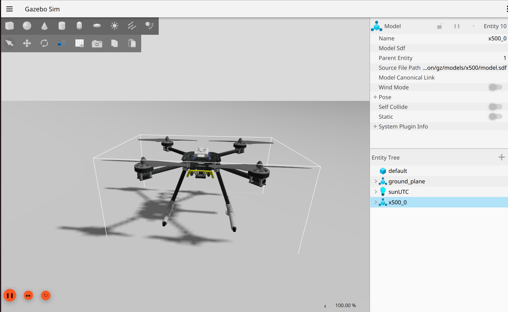

This documentation records a PX4 simulation setup performed on Ubuntu 24.04.4 LTS Noble. The stack used here is ROS 2 Jazzy, Gazebo Harmonic, PX4 SITL, and Micro XRCE-DDS Agent.

PX4's Gazebo SITL route supports Ubuntu 24.04 and Gazebo Harmonic. The PX4 ROS 2 user guide still primarily recommends Ubuntu 22.04 and ROS 2 Humble, so this page records the practical Jazzy/Harmonic route used on this machine and keeps compatibility notes explicit.

<div class="agent-download-card">
  <div class="agent-download-main">
    <div class="agent-download-logos" aria-label="Agent tools">
      <a class="agent-logo agent-logo-codex" href="https://openai.com/codex/" title="Open Codex official website" target="_blank" rel="noopener">
        <svg viewBox="0 0 64 64" aria-hidden="true" focusable="false">
          <defs>
            <linearGradient id="codex-agent-gradient-px4" x1="32" x2="32" y1="8" y2="56" gradientUnits="userSpaceOnUse">
              <stop offset="0" stop-color="#b5a0ff" />
              <stop offset="0.52" stop-color="#6b8eff" />
              <stop offset="1" stop-color="#2f3fff" />
            </linearGradient>
          </defs>
          <path fill="url(#codex-agent-gradient-px4)" d="M25.8 54.8c-5.5 0-10.3-3.4-12.2-8.2C7.8 44.8 4 39.4 4 33.1c0-7.1 4.9-13.1 11.5-14.7C18.2 12.4 24.2 8.2 31 8.2c5.1 0 9.8 2.1 13.1 5.6 1.5-.4 3-.7 4.7-.7 8 0 14.5 6.5 14.5 14.5 0 2.2-.5 4.2-1.3 6 2.4 2.2 3.8 5.4 3.8 8.9 0 6.8-5.5 12.3-12.3 12.3H25.8Z" />
          <path d="M24.4 26.2 31.3 33l-6.9 6.8" fill="none" stroke="#fff" stroke-linecap="round" stroke-linejoin="round" stroke-width="5.4" />
          <path d="M40.2 39.2h10.6" fill="none" stroke="#fff" stroke-linecap="round" stroke-width="5.4" />
        </svg>
        Codex
      </a>
      <a class="agent-logo agent-logo-claude" href="https://claude.com/product/claude-code" title="Open Claude Code official website" target="_blank" rel="noopener">
        <svg viewBox="-9 1 86 92" aria-hidden="true" focusable="false">
          <path fill="#d87553" d="M31.4 24.4 36.2 5.1l3-2.1 3.7 1.9 2.1 2.8-4.2 22.4.9.8 12.8-15.6 5.3-.1 3 4.2-1.1 3.9-16 18.4.6 1.1 20.4-4.4 4.4 1.2 1.4 3.2-1.3 3.2-22.6 5.4v1l21.6 2 5.6 3.8.4 3.5-3.7 2.3-20.6-4.5-.8.8 15 14.4.6 4.2-2.5 2.7-4.2-1.6-16-14.8-1 .6 10.4 16.2-.1 4.9-2.9 2.2-4.3-.4-13.1-20.1-1.2.3-3.8 21.4-3.1 2.1-3.5-1.8-1.5-3 4.6-22.4-1-.6-15 19.3-3.5 1.7-2.8-1.5-.4-3.1 15.7-20.8-.6-1.1-18.2 12.9-5 1.6-2.2-2.3.4-3.9L20.9 53l-.2-1.2-24.1-1-4-2.4.2-3.3 2.3-2.1 24.9 1.6.5-1.1L.8 30.6-.4 26.8l2.7-2.4 4.2.4L28.1 40l1.1-.5L14.6 15.8l-.9-4.3 2.5-3.2 4.4.3 11.7 26.1 1.3-.2Z" />
        </svg>
        Claude Code
      </a>
    </div>
    <p><strong>Using an agent to install this stack?</strong> Download the PX4 agent-oriented Markdown guide and give it directly to Codex, Claude Code, Cursor Agent, or a similar coding agent.</p>
  </div>
  <a class="agent-download-button" href="/downloads/Ubuntu24-PX4-ROS2-Jazzy-Gazebo-Harmonic-SITL-Agent-Installation-Guide.md" download>
    Download MD
  </a>
</div>

## 0. Initial System State

```shell
uname -a
lsb_release -a
ls -la /opt/ros
command -v ros2
command -v gz
command -v colcon
command -v vcs
command -v MicroXRCEAgent
```

The initial checks on 2026-06-24 were:

```text
Ubuntu 24.04.4 LTS, codename noble
ROS 2: /opt/ros/jazzy/bin/ros2
ROS_DISTRO=jazzy
Gazebo: gz-harmonic installed
gz-harmonic=1.0.0-1~noble
libgz-sim8-dev=8.14.0-1~noble
gz sim --versions reported 8.11.0
MicroXRCEAgent: command not found
PX4-Autopilot: not yet found at ~/PX4-Autopilot
```

This machine already had an ArduPilot ROS 2/Gazebo environment. For PX4, use a clean terminal and avoid inheriting ArduPilot paths such as `~/ardu_ws/install/...`, `GZ_SIM_RESOURCE_PATH`, `SDF_PATH`, and `~/venv-ardupilot/bin`.

## 0.1 Current Completed State

By the end of the setup on 2026-06-24, the local state was:

```text
PX4-Autopilot: ~/PX4-Autopilot
PX4 branch: main
PX4 commit: 3042f906ab
PX4 submodules: 35
PX4 Python venv: ~/venv-px4
Micro XRCE-DDS Agent: ~/Micro-XRCE-DDS-Agent, tag v2.4.3, commit 7362281
ROS 2 workspace: ~/px4_ros2_ws
px4_msgs branch: main
px4_ros_com branch: main
```

Verified locally:

- `make px4_sitl` built successfully and generated `~/PX4-Autopilot/build/px4_sitl_default/bin/px4`.
- `PX4_GZ_NO_FOLLOW=1 make px4_sitl gz_x500` started PX4 with Gazebo simulator `8.11.0`, PX4's `default.sdf` world, and the `x500_0` model.
- PX4 SITL started `uxrce_dds_client` against `127.0.0.1:8888`.
- The locally built `MicroXRCEAgent udp4 -p 8888` accepted the PX4 DDS connection.
- `px4_msgs` and `px4_ros_com` built successfully in ROS 2 Jazzy.
- ROS 2 Jazzy could list `/fmu/in/...` and `/fmu/out/...` topics.
- `ros2 topic echo /fmu/out/sensor_combined --once` received IMU data.

Example `sensor_combined` output:

```text
timestamp: 1782236469088097
gyro_rad:
- -0.0009602049249224365
- -0.00032172040664590895
- -0.0013022938510403037
accelerometer_m_s2:
- 0.0025522205978631973
- -0.004136626608669758
- -9.807899475097656
```

## 1. Version Choices

| Component | Local choice | Notes |
|---|---|---|
| Ubuntu | 24.04.4 LTS Noble | PX4 supports Ubuntu 24.04 and 22.04 |
| ROS 2 | Jazzy Jalisco | Native ROS 2 release for Ubuntu 24.04 |
| Gazebo | Harmonic | Supported by PX4's Ubuntu and Gazebo SITL routes |
| Gazebo Sim ABI | `libgz-sim8` | Gazebo Harmonic uses Gazebo Sim 8 |
| PX4 workspace | `~/PX4-Autopilot` | PX4 upstream source tree |
| ROS 2 workspace | `~/px4_ros2_ws` | Holds `px4_msgs`, `px4_ros_com`, and custom ROS 2 nodes |
| DDS transport | PX4 uXRCE-DDS + Micro XRCE-DDS Agent | PX4 v1.14+ ROS 2 communication path |
| Ground station | QGroundControl | Usually auto-connects to PX4 SITL over UDP |

Official references:

- [PX4 Ubuntu Development Environment](https://docs.px4.io/main/en/dev_setup/dev_env_linux_ubuntu)
- [PX4 Gazebo Simulation](https://docs.px4.io/main/en/sim_gazebo_gz/)
- [PX4 ROS 2 User Guide](https://docs.px4.io/main/en/ros2/user_guide)
- [ROS 2 Jazzy Ubuntu deb packages](https://docs.ros.org/en/jazzy/Installation/Ubuntu-Install-Debs.html)
- [Gazebo Harmonic on Ubuntu](https://gazebosim.org/docs/harmonic/install_ubuntu/)

## 2. Install ROS 2 Jazzy

Skip this section if ROS 2 Jazzy is already installed and verified.

### 2.1 Locale

```shell
locale
sudo apt update
sudo apt install locales -y
sudo locale-gen en_US en_US.UTF-8
sudo update-locale LC_ALL=en_US.UTF-8 LANG=en_US.UTF-8
export LANG=en_US.UTF-8
locale
```

### 2.2 Enable Ubuntu Universe

```shell
sudo apt install software-properties-common -y
sudo add-apt-repository universe
```

### 2.3 Add the ROS 2 Apt Source

In 2026, ROS recommends using the `ros2-apt-source` package to manage the apt source and key.

```shell
sudo apt update
sudo apt install curl gnupg lsb-release software-properties-common locales -y
```

```shell
sudo apt update
sudo apt install curl -y
export ROS_APT_SOURCE_VERSION=$(curl -s https://api.github.com/repos/ros-infrastructure/ros-apt-source/releases/latest | grep -F "tag_name" | awk -F'"' '{print $4}')
curl -L -o /tmp/ros2-apt-source.deb "https://github.com/ros-infrastructure/ros-apt-source/releases/download/${ROS_APT_SOURCE_VERSION}/ros2-apt-source_${ROS_APT_SOURCE_VERSION}.$(. /etc/os-release && echo ${UBUNTU_CODENAME:-${VERSION_CODENAME}})_all.deb"
sudo dpkg -i /tmp/ros2-apt-source.deb
```

### 2.4 Install ROS 2 Jazzy Desktop and Development Tools

```shell
sudo apt update
sudo apt full-upgrade -y
sudo apt install ros-jazzy-desktop ros-dev-tools -y
```

If `ros-dev-tools` reports dependency conflicts, check that Noble updates and backports are enabled:

```shell
grep Suites /etc/apt/sources.list.d/ubuntu.sources
```

The normal suites should include:

```text
Suites: noble noble-updates noble-backports
```

### 2.5 ROS 2 Environment Variables

Test manually first:

```shell
source /opt/ros/jazzy/setup.bash
printenv | grep -i ROS
ros2 pkg list | head
```

Then add this to `~/.bashrc`:

```shell
cat <<'EOF' >> ~/.bashrc

# ROS 2 Jazzy, Ubuntu 24.04
source /opt/ros/jazzy/setup.bash
export ROS_DOMAIN_ID=0
export ROS_LOCALHOST_ONLY=0
EOF
source ~/.bashrc
```

### 2.6 Test ROS 2

Terminal 1:

```shell
source /opt/ros/jazzy/setup.bash
ros2 run demo_nodes_cpp talker
```

Terminal 2:

```shell
source /opt/ros/jazzy/setup.bash
ros2 run demo_nodes_py listener
```

If the listener receives messages from the talker, the ROS 2 base installation works.

## 3. Install Gazebo Harmonic

If `gz-harmonic` is already installed, just run the verification commands.

```shell
sudo apt-get update
sudo apt-get install curl lsb-release gnupg -y
sudo curl https://packages.osrfoundation.org/gazebo.gpg --output /usr/share/keyrings/pkgs-osrf-archive-keyring.gpg
echo "deb [arch=$(dpkg --print-architecture) signed-by=/usr/share/keyrings/pkgs-osrf-archive-keyring.gpg] https://packages.osrfoundation.org/gazebo/ubuntu-stable $(lsb_release -cs) main" | sudo tee /etc/apt/sources.list.d/gazebo-stable.list > /dev/null
sudo apt-get update
sudo apt-get install gz-harmonic -y
```

Add this to `~/.bashrc`:

```shell
cat <<'EOF' >> ~/.bashrc

# Gazebo Harmonic for PX4 simulation
export GZ_VERSION=harmonic
EOF
source ~/.bashrc
```

Verify:

```shell
gz sim --versions
apt-cache policy gz-harmonic libgz-sim8 libgz-sim8-dev
```

Local record from 2026-06-24:

```text
gz-harmonic=1.0.0-1~noble
libgz-sim8=8.14.0-1~noble
libgz-sim8-dev=8.14.0-1~noble
gz sim --versions reported 8.11.0
```

For this route, do not install `gazebo11` or `libgazebo-dev`. Those belong to Gazebo Classic and can create confusing mixed environments.

## 4. Install PX4 Base Dependencies

PX4 recommends using the repository script `Tools/setup/ubuntu.sh`. Because Gazebo Harmonic was already installed on this machine, the local route used `--no-sim-tools` to avoid reinstalling simulator tooling.

Install common tools:

```shell
sudo apt update
sudo apt install git wget curl python3-pip python3-venv python3-colcon-common-extensions python3-vcstool -y
```

Clone PX4:

```shell
cd ~
git clone https://github.com/PX4/PX4-Autopilot.git --recursive
```

Install PX4 development dependencies:

```shell
bash ~/PX4-Autopilot/Tools/setup/ubuntu.sh --no-sim-tools
```

Notes:

- On a clean Ubuntu installation, running `bash ./PX4-Autopilot/Tools/setup/ubuntu.sh` directly is also reasonable; the script will install the recommended simulator dependencies.
- On this machine, Harmonic was already installed, so `--no-sim-tools` kept the existing Gazebo setup.
- After the script finishes, reboot or open a fresh terminal.
- Do not reuse `~/venv-ardupilot`; otherwise CMake may find the ArduPilot Python environment and miss PX4 Python dependencies such as `kconfiglib` or `menuconfig`.

Local setup used a dedicated PX4 Python venv:

```shell
/usr/bin/python3 -m venv ~/venv-px4
~/venv-px4/bin/python -m pip install --upgrade pip
~/venv-px4/bin/python -m pip install -r ~/PX4-Autopilot/Tools/setup/requirements.txt
```

Update submodules:

```shell
cd ~/PX4-Autopilot
git submodule update --init --recursive
```

## 5. Test PX4 SITL with Gazebo Harmonic

Use a clean terminal. Do not source `~/ardu_ws/install/setup.bash`, and avoid inheriting ArduPilot's Gazebo resource paths.

Check the current shell:

```shell
command -v gz
gz sim --versions
printenv | grep -E '^(ROS_DISTRO|ROS_DOMAIN_ID|GZ_VERSION|GZ_SIM_RESOURCE_PATH|SDF_PATH)='
```

If ArduPilot paths are present, clean them for this PX4 session:

```shell
unset VIRTUAL_ENV
unset PYTHONPATH
unset GZ_SIM_RESOURCE_PATH
unset SDF_PATH
export GZ_VERSION=harmonic
export PATH=~/venv-px4/bin:/usr/local/sbin:/usr/local/bin:/usr/sbin:/usr/bin:/sbin:/bin
```

Preferred GUI launch:

```shell
cd ~/PX4-Autopilot
PX4_GZ_NO_FOLLOW=1 make px4_sitl gz_x500 PYTHON_EXECUTABLE=~/venv-px4/bin/python
```

PX4's Gazebo launch script normally switches the GUI camera into follow mode after the model spawns. Setting `PX4_GZ_NO_FOLLOW=1` keeps the Gazebo GUI camera free to rotate, pan, and zoom.

The follow-camera log lines look like:

```text
INFO  [init] Setting camera to follow x500_0
INFO  [init] Camera follow offset set to -2.0, -2.0, 2.0
```

With `PX4_GZ_NO_FOLLOW=1`, these lines should not appear.



Useful Gazebo GUI controls:

```text
Right drag: rotate view
Middle drag: pan view
Mouse wheel: zoom
Left click: select entity
```

Headless mode:

```shell
cd ~/PX4-Autopilot
HEADLESS=1 make px4_sitl gz_x500 PYTHON_EXECUTABLE=~/venv-px4/bin/python
```

Local headless output included:

```text
PX4 starting.
INFO  [init] Gazebo simulator 8.11.0
INFO  [init] Starting gazebo with world: /home/gao/PX4-Autopilot/Tools/simulation/gz/worlds/default.sdf
INFO  [init] Gazebo world is ready
INFO  [gz_bridge] world: default, model: x500_0
INFO  [uxrce_dds_client] init UDP agent IP:127.0.0.1, port:8888
INFO  [mavlink] mode: Normal, data rate: 4000000 B/s on udp port 18570 remote port 14550
INFO  [mavlink] mode: Onboard, data rate: 4000000 B/s on udp port 14580 remote port 14540
```

The `gz_frame_id` SDF warnings seen during this test did not prevent the simulation from starting.

Set a world:

```shell
cd ~/PX4-Autopilot
PX4_GZ_WORLD=windy make px4_sitl gz_x500
```

Set the simulation speed factor:

```shell
cd ~/PX4-Autopilot
PX4_SIM_SPEED_FACTOR=2 make px4_sitl gz_x500
```

Common PX4 Gazebo targets:

| Vehicle | Command |
|---|---|
| X500 quadrotor | `make px4_sitl gz_x500` |
| X500 with front depth camera | `make px4_sitl gz_x500_depth` |
| X500 with vision odometry | `make px4_sitl gz_x500_vision` |
| X500 with 2D LiDAR | `make px4_sitl gz_x500_lidar_2d` |
| VTOL | `make px4_sitl gz_standard_vtol` |
| Fixed wing | `make px4_sitl gz_rc_cessna` |

## 6. Start Gazebo and PX4 Separately

PX4 also supports standalone mode, where Gazebo and PX4 SITL are started in separate terminals.

Terminal 1, start Gazebo:

```shell
cd ~
wget https://raw.githubusercontent.com/PX4/PX4-gazebo-models/main/simulation-gazebo
python3 simulation-gazebo
```

Terminal 2, start PX4 and wait for Gazebo:

```shell
cd ~/PX4-Autopilot
PX4_GZ_STANDALONE=1 make px4_sitl gz_x500
```

If PX4 starts before Gazebo, the bridge may print:

```text
WARN [gz bridge] Service call timed out as Gazebo has not been detected
```

Once Gazebo starts, PX4 should continue and connect.

## 7. Configure PX4 + ROS 2 Communication

PX4 v1.14 and later use uXRCE-DDS for ROS 2 communication. PX4 SITL automatically starts `uxrce_dds_client`, which connects to UDP port `8888` on localhost by default. The host must run `MicroXRCEAgent`.

### 7.1 Install Micro XRCE-DDS Agent

PX4's example uses eProsima Micro XRCE-DDS Agent `v2.4.3`:

```shell
cd ~
git clone -b v2.4.3 https://github.com/eProsima/Micro-XRCE-DDS-Agent.git
cd Micro-XRCE-DDS-Agent
mkdir build
cd build
cmake ..
make
sudo make install
sudo ldconfig /usr/local/lib/
```

Verify:

```shell
command -v MicroXRCEAgent
MicroXRCEAgent --help
```

Start the agent:

```shell
MicroXRCEAgent udp4 -p 8888
```

Only one process can bind to port `8888`; stop any old agent before starting a new one.

On this machine, the agent was built locally without `sudo make install`:

```shell
cd ~
git clone -b v2.4.3 https://github.com/eProsima/Micro-XRCE-DDS-Agent.git
cd ~/Micro-XRCE-DDS-Agent
mkdir -p build
cd build
cmake ..
make -j4
```

Local binary:

```text
~/Micro-XRCE-DDS-Agent/build/MicroXRCEAgent
```

Start the local build:

```shell
unset LD_LIBRARY_PATH
export LD_LIBRARY_PATH=~/Micro-XRCE-DDS-Agent/build:~/Micro-XRCE-DDS-Agent/build/temp_install/fastrtps-2.14/lib:~/Micro-XRCE-DDS-Agent/build/temp_install/fastcdr-2.2.0/lib:~/Micro-XRCE-DDS-Agent/build/temp_install/microxrcedds_client-2.4.3/lib:~/Micro-XRCE-DDS-Agent/build/temp_install/microcdr-2.0.1/lib
~/Micro-XRCE-DDS-Agent/build/MicroXRCEAgent udp4 -p 8888
```

The ArduPilot environment on this machine also has `micro_ros_agent` library paths. Clear `LD_LIBRARY_PATH` before running the local PX4 agent to avoid linking against ArduPilot workspace libraries.

### 7.2 Start PX4 SITL Client

Terminal 2:

```shell
cd ~/PX4-Autopilot
make px4_sitl gz_x500
```

PX4 should print `uxrce_dds_client` synchronization and data writer logs. The agent terminal should show created publishers and subscribers.

### 7.3 Create the ROS 2 Workspace

```shell
mkdir -p ~/px4_ros2_ws/src
cd ~/px4_ros2_ws/src
git clone https://github.com/PX4/px4_msgs.git
git clone https://github.com/PX4/px4_ros_com.git
```

Notes:

- `px4_msgs` must match the PX4 firmware message definitions.
- If PX4 uses `main`, the `px4_msgs` `main` branch usually matches the current development version.
- If PX4 uses a release branch, switch `px4_msgs` to the corresponding release branch.
- PX4 v1.16+ introduces message versioning; translation nodes can help across versions, but the basic test should keep versions aligned.

Build:

```shell
cd ~/px4_ros2_ws
source /opt/ros/jazzy/setup.bash
colcon build
source install/local_setup.bash
```

Local Jazzy build command:

```shell
cd ~/px4_ros2_ws
unset VIRTUAL_ENV
unset PYTHONPATH
unset GZ_SIM_RESOURCE_PATH
unset SDF_PATH
unset LD_LIBRARY_PATH
source /opt/ros/jazzy/setup.bash
colcon build --event-handlers console_direct+
source install/local_setup.bash
```

Local build result:

```text
px4_msgs: finished, detected version 1.17.0
px4_ros_com: finished
summary: 2 packages finished
```

If `px4_ros_com` fails on Jazzy, record the full error first, then decide whether to switch branches, install missing dependencies, or build only `px4_msgs` plus custom nodes.

### 7.4 Check ROS 2 Topics

After Micro XRCE-DDS Agent and PX4 SITL are both running, open a new terminal:

```shell
source /opt/ros/jazzy/setup.bash
source ~/px4_ros2_ws/install/local_setup.bash
ros2 topic list | grep /fmu
```

Common topics:

```text
/fmu/out/sensor_combined
/fmu/out/vehicle_odometry
/fmu/out/vehicle_status
/fmu/in/offboard_control_mode
/fmu/in/trajectory_setpoint
/fmu/in/vehicle_command
```

Listen to IMU data:

```shell
ros2 topic echo /fmu/out/sensor_combined
```

If data appears, the PX4 -> uXRCE-DDS Agent -> ROS 2 path works.

Local verification:

```shell
ros2 topic list | grep /fmu
ros2 topic echo /fmu/out/sensor_combined --once
```

ROS 2 Jazzy listed `/fmu/in/...` and `/fmu/out/...`, and `sensor_combined` produced data.

## 8. QGroundControl Connection

After PX4 SITL starts, QGroundControl usually auto-discovers the vehicle through local UDP.

Check in QGroundControl:

- The top-left vehicle indicator shows a connected PX4 vehicle.
- Vehicle Setup can show airframe, parameters, and sensors.
- The Fly page shows the simulated vehicle state.

If QGroundControl does not auto-connect, open `Application Settings` -> `Comm Links` and add a UDP link manually. PX4 SITL commonly uses MAVLink UDP ports such as `14540` and `14550`; use the exact ports printed by the PX4 terminal.

## 9. Recommended Clean PX4 Shell Blocks

Because this machine has both ArduPilot and PX4 environments, use this block before starting PX4:

```shell
# PX4 + ROS 2 Jazzy + Gazebo Harmonic clean shell
unset VIRTUAL_ENV
unset PYTHONPATH
unset GZ_SIM_RESOURCE_PATH
unset SDF_PATH
unset LD_LIBRARY_PATH
export ROS_DOMAIN_ID=0
export ROS_LOCALHOST_ONLY=0
export GZ_VERSION=harmonic
export PX4_GZ_NO_FOLLOW=1
export PATH=~/venv-px4/bin:/usr/local/sbin:/usr/local/bin:/usr/sbin:/usr/bin:/sbin:/bin
```

Start PX4 SITL with GUI camera follow disabled:

```shell
cd ~/PX4-Autopilot
make px4_sitl gz_x500 PYTHON_EXECUTABLE=~/venv-px4/bin/python
```

For ROS 2 communication or automated checks without GUI:

```shell
cd ~/PX4-Autopilot
HEADLESS=1 make px4_sitl gz_x500 PYTHON_EXECUTABLE=~/venv-px4/bin/python
```

Use a separate ROS 2 terminal for topic inspection:

```shell
unset VIRTUAL_ENV
unset PYTHONPATH
unset GZ_SIM_RESOURCE_PATH
unset SDF_PATH
unset LD_LIBRARY_PATH
source /opt/ros/jazzy/setup.bash
source ~/px4_ros2_ws/install/local_setup.bash
ros2 topic list | grep /fmu
```

Do not source this in the PX4 terminal unless doing an explicit comparison experiment:

```shell
source ~/ardu_ws/install/setup.bash
```

## 10. Common Issues

### 10.1 `MicroXRCEAgent: command not found`

The host-side Micro XRCE-DDS Agent is not installed. Build it from source as shown in section 7.1.

### 10.2 `ninja: error: unknown target 'gz_x500'`

Clean the PX4 build and try again:

```shell
cd ~/PX4-Autopilot
make distclean
make px4_sitl gz_x500
```

### 10.3 Gazebo Opens with the Wrong World or Model

First check whether the shell inherited ArduPilot resource paths:

```shell
printenv | grep -E '^(GZ_SIM_RESOURCE_PATH|SDF_PATH)='
```

Temporarily clear them:

```shell
unset GZ_SIM_RESOURCE_PATH
unset SDF_PATH
```

Restart PX4:

```shell
cd ~/PX4-Autopilot
make px4_sitl gz_x500
```

### 10.4 ROS 2 Cannot See `/fmu/...` Topics

Check each process:

```shell
pgrep -af MicroXRCEAgent
pgrep -af px4
ros2 topic list | grep /fmu
```

Confirm:

- `MicroXRCEAgent udp4 -p 8888` is running.
- PX4 SITL is running.
- The PX4 terminal does not show `uxrce_dds_client` errors.
- The ROS 2 terminal sourced `/opt/ros/jazzy/setup.bash` and `~/px4_ros2_ws/install/local_setup.bash`.

### 10.5 ROS 2 Jazzy Differs from PX4's Humble-Oriented Examples

The local route is:

```text
Ubuntu 24.04.4 + ROS 2 Jazzy + Gazebo Harmonic + PX4 main
```

This is a reasonable 2026 Ubuntu 24.04 setup, but some PX4 ROS 2 examples and third-party offboard examples may still assume Humble. When `px4_ros_com` examples or custom nodes fail under Jazzy, record the concrete build/runtime error and resolve it case by case.

### 10.6 Gazebo GUI Camera Suddenly Locks onto the Vehicle

Symptom:

```text
The Gazebo GUI is movable at first.
After x500_0 spawns, the view switches to a vehicle-follow camera.
Manual rotate/pan becomes awkward, as if the camera were locked.
```

Cause:

PX4's Gazebo startup script sends a follow-camera command by default.

Relevant script:

```text
~/PX4-Autopilot/ROMFS/px4fmu_common/init.d-posix/px4-rc.gzsim
```

Fix:

```shell
cd ~/PX4-Autopilot
PX4_GZ_NO_FOLLOW=1 make px4_sitl gz_x500 PYTHON_EXECUTABLE=~/venv-px4/bin/python
```

## 11. Remaining Local Checks

- [x] Clone `~/PX4-Autopilot`.
- [x] Create `~/venv-px4` and install PX4 Python requirements.
- [x] Build `make px4_sitl`.
- [x] Start `PX4_GZ_NO_FOLLOW=1 make px4_sitl gz_x500` and verify the Gazebo GUI camera is not automatically locked.
- [x] Build and start `MicroXRCEAgent udp4 -p 8888`.
- [x] Create `~/px4_ros2_ws` and build `px4_msgs` plus `px4_ros_com`.
- [x] Confirm ROS 2 Jazzy can list `/fmu` topics.
- [x] Confirm `/fmu/out/sensor_combined` can be echoed.
- [ ] Test QGroundControl auto-connection to PX4 SITL.
- [ ] Test `px4_ros_com` offboard examples.
- [ ] Record compatibility notes for future custom ROS 2 nodes under Jazzy.

## 12. Actual Setup Log

- 2026-06-24: Created this PX4 + ROS 2 Jazzy + Gazebo Harmonic setup record.
- 2026-06-24: Confirmed Ubuntu 24.04.4 LTS Noble, ROS 2 Jazzy, Gazebo Harmonic, and `libgz-sim8-dev=8.14.0-1~noble`.
- 2026-06-24: Confirmed `MicroXRCEAgent` was not installed at the start.
- 2026-06-24: Recorded that this machine also has an ArduPilot environment, so PX4 sessions should clear `GZ_SIM_RESOURCE_PATH` and `SDF_PATH`.
- 2026-06-24: Cloned `~/PX4-Autopilot`, branch `main`, commit `3042f906ab`.
- 2026-06-24: Created `~/venv-px4`, preventing PX4 builds from using `~/venv-ardupilot`.
- 2026-06-24: Completed `make px4_sitl`, `PX4_GZ_NO_FOLLOW=1 make px4_sitl gz_x500`, and `HEADLESS=1 make px4_sitl gz_x500`. Gazebo Harmonic/Sim 8.11.0 loaded `x500_0`.
- 2026-06-24: Confirmed PX4's default Gazebo follow camera can lock the GUI view, and recorded `PX4_GZ_NO_FOLLOW=1` as the preferred GUI launch setting.
- 2026-06-24: Built eProsima Micro XRCE-DDS Agent `v2.4.3` from source and started `~/Micro-XRCE-DDS-Agent/build/MicroXRCEAgent udp4 -p 8888`.
- 2026-06-24: Created and built `~/px4_ros2_ws`; `px4_msgs` and `px4_ros_com` built successfully under ROS 2 Jazzy.
- 2026-06-24: Verified PX4 SITL -> Micro XRCE-DDS Agent -> ROS 2 Jazzy communication by echoing `/fmu/out/sensor_combined`.
